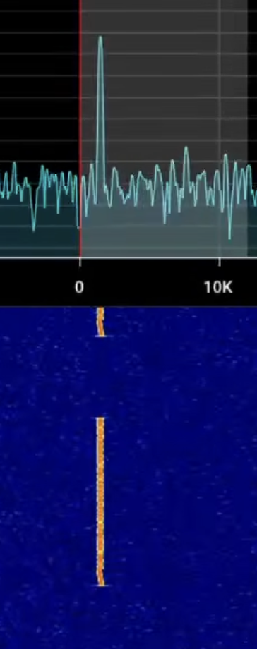
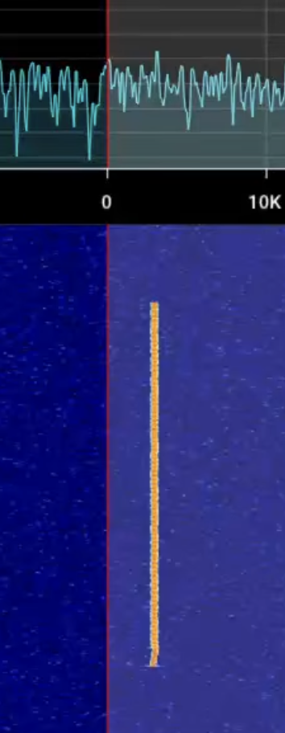

# Lyra

(I do want heavily emphasise that this is still a work in progress and there will be bugs and issues, but just dm them to me or put it in the issue tab and I will have a look at it. User: plutobypluto for dc. I also do a devlog here https://www.youtube.com/@ads_will1)

Lyra is an experimental digital radio mode for the 20m amateur band. It uses two GMSK rails which are 80 Hz apart and each message starts with a chirp. This makes it look and sound different from normal FT8.

There are two modes. Lyra F is the faster one and splits the message between the two rails. Lyra L is longer and sends the same data on both rails which can help if one rail is affected by fading.

This is still experimental and I have mostly tested it using virtual audio cables, not a real radio.

## running

You need Python 3. On macOS or Linux run:

```shell
./run_lyra
```

For the long v2 demo:

```shell
./run_lyra_long_v2_demo
```

On Windows use `run_lyra.bat` or `run_lyra_long_v2_demo.bat`.

The first start can take a while because it installs the needed packages.

## using it

Select your audio input, enter your call and grid, then select F or L and a channel.

Auto calls CQ and keeps making QSOs until you press stop.

Answer only answers other stations calling CQ.

Manual makes one QSO and then stops.

The power slider changes the audio output level. Start it low when using a radio so it does not clip.

## how it looks

Lyra F



Lyra L



## channels

The dial frequency is 14.1064 MHz USB. Channels 1 to 5 are Lyra F and channels 6 to 10 are Lyra L. The selected channel is only your transmit channel because the decoder listens to all 10.

The full signal can cover about 14.1068 to 14.1115 MHz. This frequency is not reserved for Lyra, so check that it is free and follow your local band rules before transmitting.

## radio

Radio control uses Hamlib rigctld. Start rigctld for your radio, press radio in Lyra, select Hamlib rigctld and connect. The normal host is 127.0.0.1 and the port is 4532.

Lyra sets the radio to 14.1064 MHz USB and asks for a 6 kHz filter. PTT is controlled through Hamlib. I have tested the commands without a radio, but not yet with a real transceiver.

## testing

To test without a radio, open Lyra twice and connect both windows with a virtual audio cable. BlackHole can be used on macOS and VB-Cable can be used on Windows. Keep the rig option on Test.

The example qso wavs folder has some example QSOs you can open in SDR++. For the long v2 one, run `./run_lyra_long_v2_demo` and open the wav from the file menu.

## license

GPLv3.